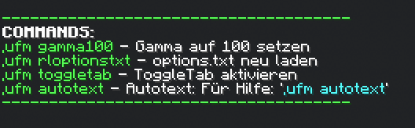
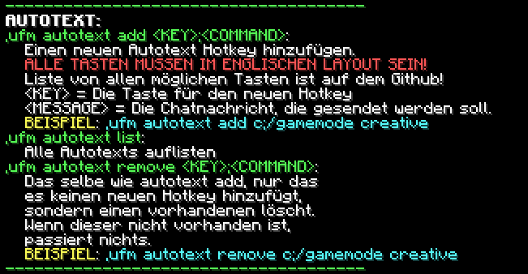

# Letsrics useful Mod (Fabric)

Diese Mod fügt ein paar nützliche Befehle zum Spiel hinzu.

---

### Installation:

- Installiere [Fabric](https://fabricmc.net/use/installer/) für Minecraft 1.18.2
- Lade dir die [Fabric API](https://www.curseforge.com/minecraft/mc-mods/fabric-api/files/all) für Minecraft 1.18.2 herunter
- Lade diese Mod unter [Releases](https://github.com/Letsric/LetsricsUsefulMod-Fabric/releases) herunter
- Kopiere Fabric API und diese Mod in deinen .minecraft/mods Ordner
- Starte den Minecraft Launcher, wähle "Fabric 1.18.2" aus, und klicke Spielen

---

### Wie man diese Mod nutzt:

Alle befehle beginnen mit ```,ufm```. \
Eine Liste von Befehlen bekommst du mit ```,ufm```. \
Falls du dich vertippst, und z.B. ```,ufm jidoasiojasdaijosd``` eingibst,
erhältst du ebenfalls eine Liste der Befehle. Falls du dich aber beim ```,ufm```
vertippst, also z.B. ```,ugm toggletab``` eingibst, **wird die nachricht 
im Chat abgesendet!**

---

### Befehlsliste:



---

### Mögliche Tasten für Autotext

- 0
- 1
- 2
- 3
- 4
- 5
- 6
- 7
- 8
- 9
- a
- b
- c
- d
- e
- f
- g
- h
- i
- j
- k
- l
- m
- n
- o
- p
- q
- r
- s
- t
- u
- v
- w
- x
- y
- z
- f1
- f2
- f3
- f4
- f5
- f6
- f7
- f8
- f9
- f10
- f11
- f12
- f13
- f14
- f15
- f16
- f17
- f18
- f19
- f20
- f21
- f22
- f23
- f24
- f25
- num.lock
- keypad.0
- keypad.1
- keypad.2
- keypad.3
- keypad.4
- keypad.5
- keypad.6
- keypad.7
- keypad.8
- keypad.9
- keypad.add
- keypad.decimal
- keypad.enter
- keypad.equal
- keypad.multiply
- keypad.divide
- keypad.subtract
- down
- left
- right
- up
- apostrophe
- backslash
- comma
- equal
- grave.accent
- left.bracket
- minus
- period
- right.bracket
- semicolon
- slash
- space
- tab
- left.alt
- left.control
- left.shift
- left.win
- right.alt
- right.control
- right.shift
- right.win
- enter
- escape
- backspace
- delete
- end
- home
- insert
- page.down
- page.up
- caps.lock
- pause
- scroll.lock
- menu
- print.screen